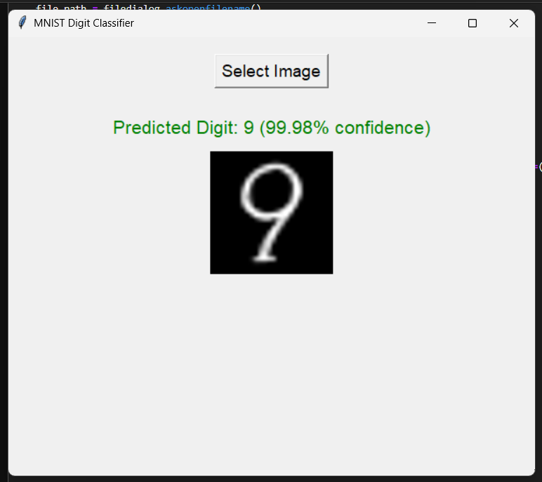

# MNIST Digit Classifier with Tkinter GUI

This project is a handwritten digit recognition system built using a Convolutional Neural Network (CNN) trained on the MNIST dataset. It features a simple and user-friendly graphical interface using Tkinter, allowing users to upload an image of a handwritten digit and receive the predicted result in real-time.

---

## 📦 Features

- Upload and classify your own digit images.
- Clean and intuitive Tkinter-based GUI.
- Full-screen display with image preview and prediction.
- Trained using TensorFlow and Keras on the MNIST dataset.
- Model inference runs locally — no internet needed after setup.

---

## 🧠 Tech Stack

- **Frontend GUI**: Python `tkinter`
- **Model Training**: `TensorFlow` + `Keras`
- **Image Processing**: `PIL (Pillow)`, `numpy`

---

## 🗂️ Project Structure
- **mnist_project.ipynb**: Contains the python code for preprocessing data, training & evaluating the CNN for image recognition and the graphical interface.
- **Output.png**: Contains the image of the output.
- **Test_Images**: Folder contains images to test the model manually with GUI.
- **mnist_model.keras**: CNN model saved in file format. You an use it directly in case of testing.

---

## 🚀 Getting Started

### 1. Clone the Repository

```bash
git clone https://github.com/coderkun12/Digit-Recognition.git
cd Digit-Recognition
```

### 2. Install dependencies:
```bash
pip install -r requirements.txt
```
### 3. Run the App:
Approach 1: Open the jupyter notebook and run the GUI section. Please note you would need to run it on VS code or Jupyter lab and make sure you have downloaded keras file with the model before running it.

Appraoch 2: Another way to run the model is to download the app.py file and the mnist_model.keras file and run the app.py file in your terminal.

## 🖼️ Image Requirements
- The image should represent a single digit (0–9).
- Clear contrast (preferably black digit on white background).
- Image format: .png, .jpg, .jpeg (standard types supported).

## 🧪 How It Works
1. User clicks "Select Image" in the full-screen GUI.
2. The selected image is:
   - Converted to grayscale
   - Inverted (white background, black digit)
   - Resized to 28×28 pixels
   - Normalized to 0–1 scale
3. The image is passed to the CNN for prediction.
4. The predicted digit is shown below the image.

## 🖼️ Output Preview




## 🧑‍💻 Author
Kunal Kulkarni (AI Engineer)

## 📄 License
This project is licensed under the MIT License.
Feel free to modify and distribute for personal or educational purposes.
